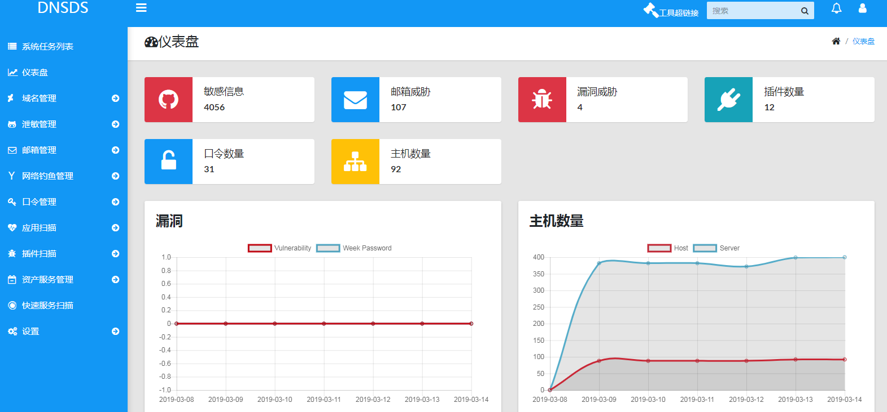
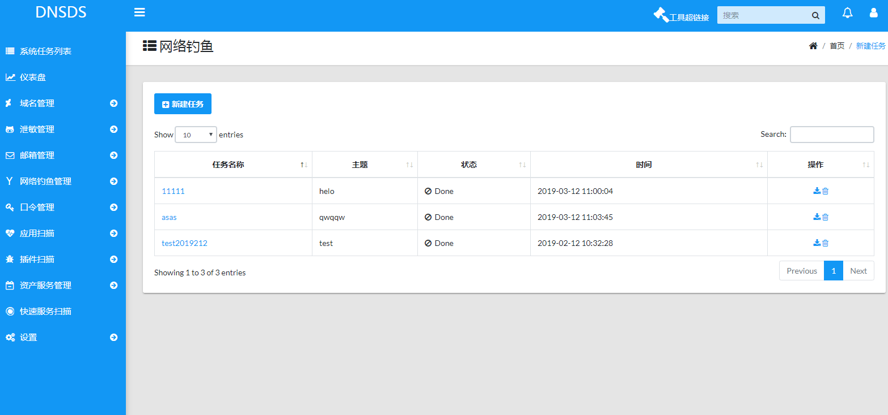
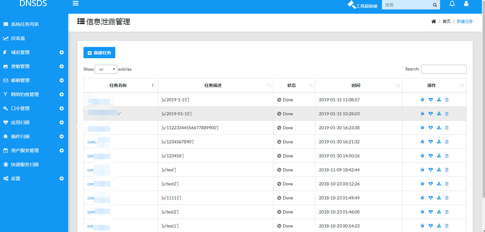
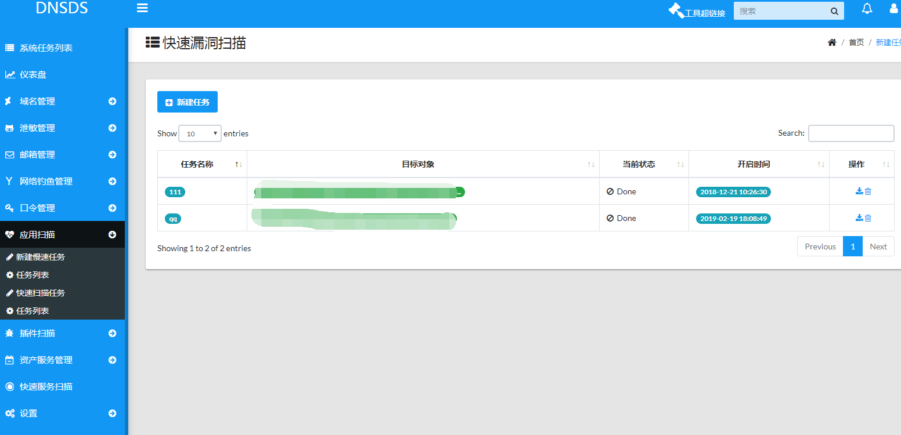
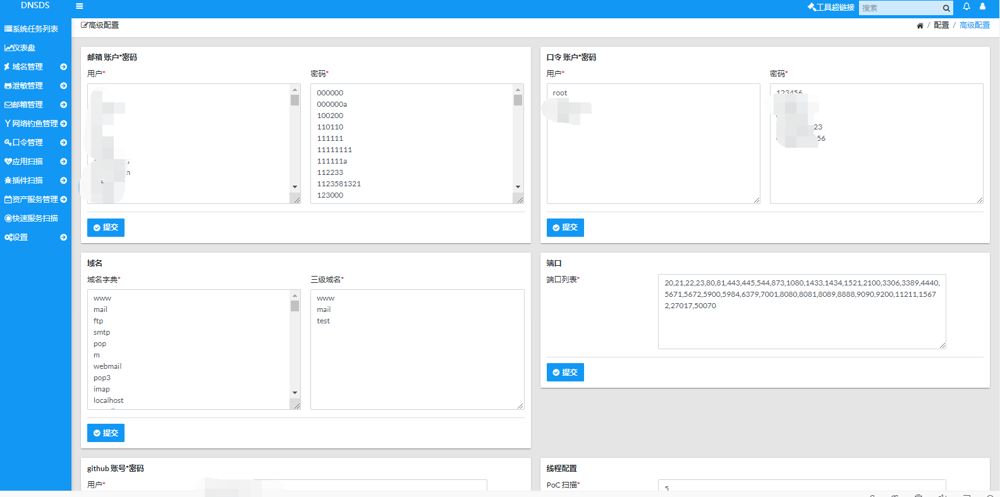

# yandi-Scanner

yandi-Scanner 是开源的网络安全检测工具，中小型企业内外网安全自动化扫描器

本系统通过模块化提供多种安全功能继承了fuxi-scanner，在此谢谢作者@fuxi-scanner

- 插件漏洞
- 网络钓鱼
- 敏感信息
- 邮箱管理
- 漏洞管理
- 快速漏洞扫描
- 弱口令检测
- 子域名收集
- 资产管理及服务发现
- 端口扫描
- AWVS调用

#### 不再更新 ###

## 截图

